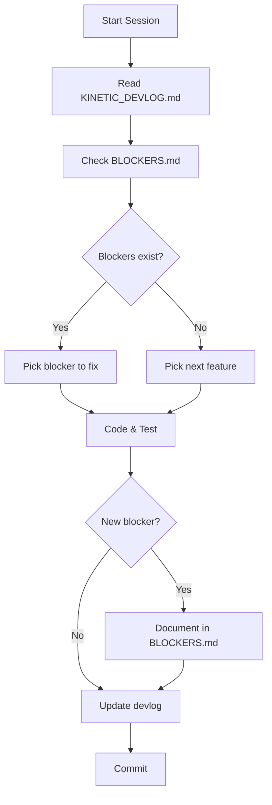

# Mixxx-Kinetic Documentation

> **Navigation**: Start here for all development documentation.

## 📚 Document Index

| Document | Purpose | Update Frequency |
|----------|---------|------------------|
| **[KINETIC_DEVLOG.md](KINETIC_DEVLOG.md)** | Current state, decisions, session logs | Every session |
| **[BLOCKERS.md](BLOCKERS.md)** | Disabled components, active issues | When code is disabled/enabled |
| **[../../MIXXX-KINETIC-SPEC.md](../../MIXXX-KINETIC-SPEC.md)** | Authoritative technical specification | Rarely (on architecture changes) |
| **[../../mixxx-kinetic-strategy.md](../../mixxx-kinetic-strategy.md)** | Strategic vision and principles | Rarely (on direction changes) |

## 🚀 Quick Start for New Sessions

1. **Read Current State**: Open [KINETIC_DEVLOG.md](KINETIC_DEVLOG.md#-current-state-2026-01-20)
2. **Check Blockers**: Review [BLOCKERS.md](BLOCKERS.md#-active-blockers)
3. **Pick Next Task**: See "Next Session Priorities" in devlog
4. **Work**: Build, test, commit
5. **Update Docs**:
   - Update Component Status table in devlog
   - Add session summary to "Recent Sessions"
   - Document any new blockers in BLOCKERS.md

## 📋 Document Responsibilities

### KINETIC_DEVLOG.md
**What belongs here**:
- ✅ Current component status (the truth)
- ✅ Architectural decisions with rationale
- ✅ Session summaries (outcomes, not play-by-play)
- ✅ Interface contracts (source of truth for APIs)

**What doesn't belong**:
- ❌ Compiler error dumps (use BLOCKERS.md)
- ❌ Step-by-step narratives
- ❌ Duplicate information from spec

### BLOCKERS.md
**What belongs here**:
- ✅ Disabled code (file paths with line numbers)
- ✅ Compilation errors preventing build
- ✅ Interface mismatches
- ✅ Clear resolution paths

**What doesn't belong**:
- ❌ Feature wishlist (use GitHub issues)
- ❌ Performance issues (unless blocking deployment)

## 🔄 Workflow

## 🎯 Success Criteria

**Well-maintained documentation**:
- Anyone can pick up the project and know exact current state in < 5 minutes
- Disabled code is tracked with clear resolution path
- No "what was I thinking?" moments when returning after a break
- Build always reflects documentation state

**Warning signs**:
- 🚨 Component Status table in devlog doesn't match build
- 🚨 Commented-out code without entry in BLOCKERS.md
- 🚨 Devlog session entries longer than 50 lines
- 🚨 No update to "Next Session Priorities" after completing work

## 📞 Getting Help

**Architecture questions**: Read [MIXXX-KINETIC-SPEC.md](../../MIXXX-KINETIC-SPEC.md)
**Build issues**: Check BLOCKERS.md first
**Lost context**: Component Status table has current state
**Forgot what to do next**: "Next Session Priorities" in devlog
